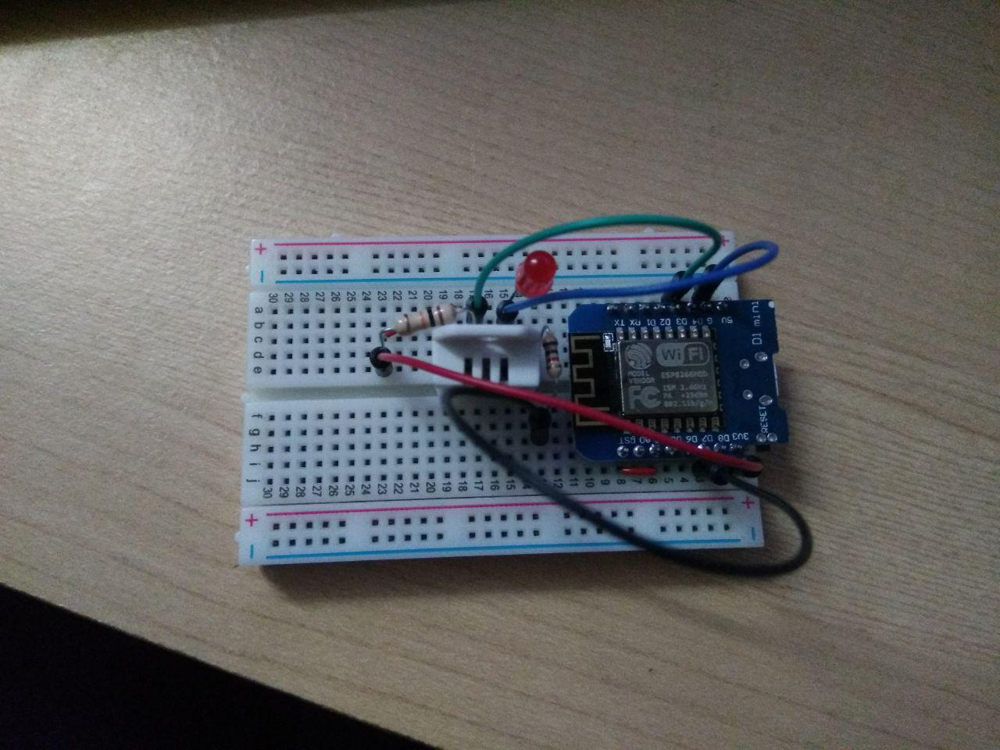

# ESP8266-DHT22
Temperature sensor based on ESP8266 streaming to google sheet.

### Disclaimer  
Arduino code is based on [this article](http://embedded-lab.com/blog/post-data-google-sheets-using-esp8266/) serveral modification.  

### Dependencies  
- [HTTPSRedirect library](https://github.com/electronicsguy/ESP8266/tree/master/HTTPSRedirect)  
- DHT library (Google how to get it for Arduino IDE)  
- ESP8266 library (Google this also if you have no idea how to install)  

### Outcome  
- [ESP8266 Temperature report](https://datastudio.google.com/reporting/181fWup_asogVT42aOg1oae8NsWL4yQnk/page/AujL)  

### Hardware

